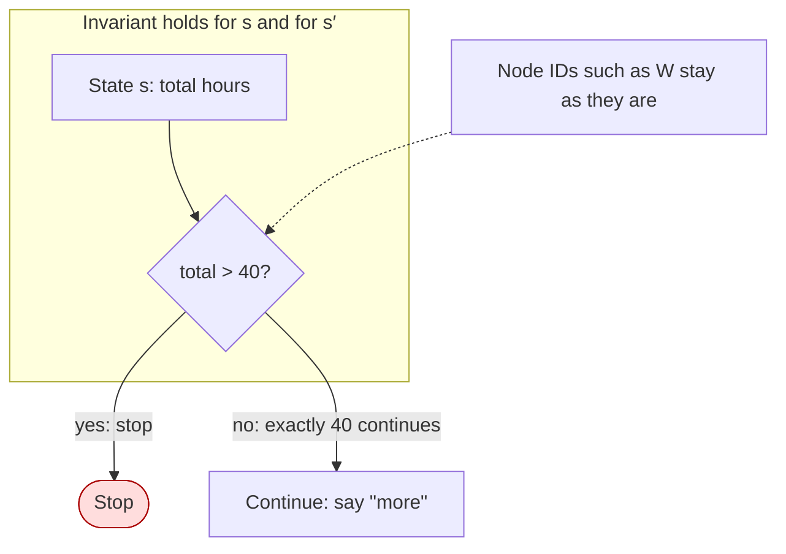
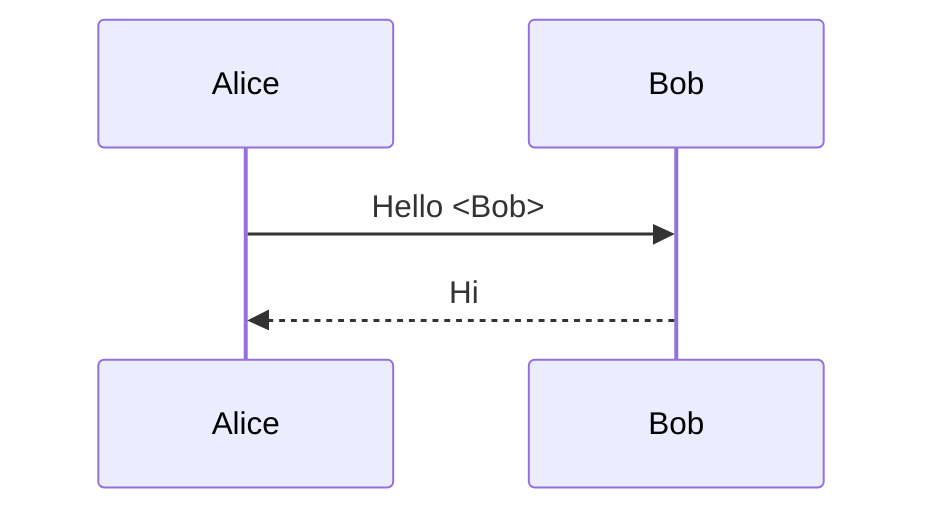

# Mermaid fixture

Prose before the diagram can be translated.

```mermaid
flowchart TB
    accTitle: The timecard rule stops only when the total is strictly greater than 40
    accDescr: A decision diagram. The total is compared with 40. If it is strictly greater than 40 the loop stops. If it is exactly 40 or less the loop continues.
    subgraph INV["Invariant holds for s and for s′"]
        S["State s: total hours"] --> D{"total #gt; 40?"}
    end
    D -- "yes: stop" --> STOP(["Stop"])
    D -- "no: exactly 40 continues" --> CONT["Continue: say #quot;more#quot;"]
    W["Node IDs such as W stay as they are"] -.-> D
    classDef warn fill:#fdd,stroke:#a00
    class STOP warn
```

Prose after the diagram. A second fence follows.

```mermaid
sequenceDiagram
    accTitle: Two actors exchange one message
    accDescr: Alice sends a greeting to Bob and Bob replies.
    participant A as Alice
    participant B as Bob
    A->>B: Hello #lt;Bob#gt;
    B-->>A: Hi
```
